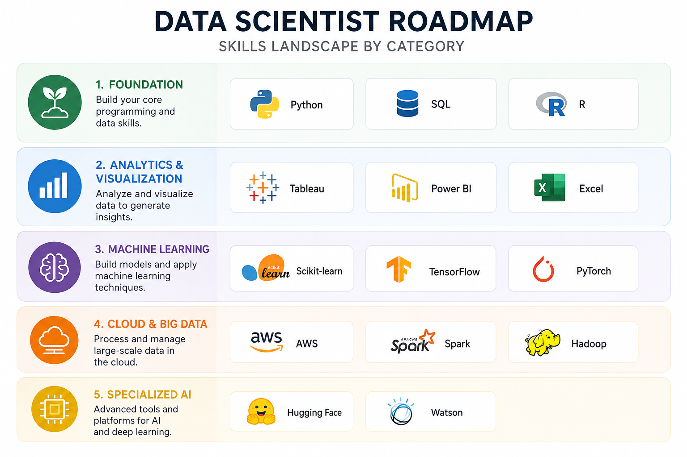

# Data Scientist Job Market Analysis

A SQL-based analysis of the U.S. Data Scientist job market to identify the skills that offer the strongest career value.

## 📁 Project Structure
### 1. [queries_sql/](queries_sql)

Contains the complete project, including the README, SQL analysis, and key findings.

### 2. [project_images/](project_images)

Contains the images and visuals used throughout the project.

## 🎯 Objective

To analyze real world data using SQL and transform raw data into meaningful, actionable insights.