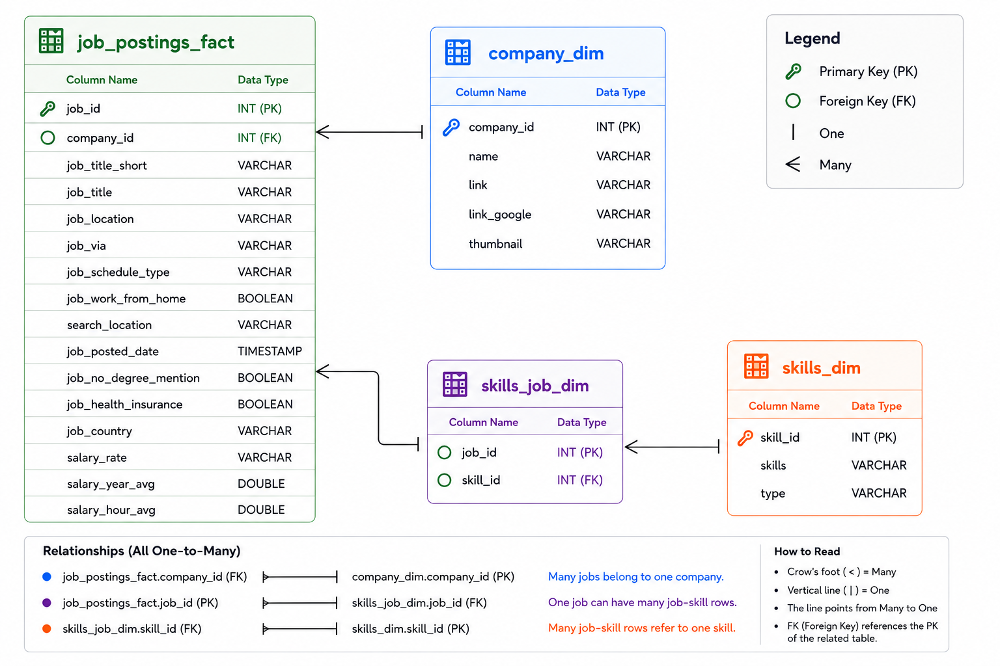

# Data-Driven Career Roadmap for Data Scientists

## Objective

Develop a data-driven career roadmap that identifies the technical skills most valued in today's U.S. Data Scientist job market.


## Project Overview

Historical job posting data provides valuable insight into the skills employers consistently seek when hiring Data Scientists. This project analyzes the U.S. job market to identify these trends and transform them into a structured, data-driven career roadmap.

## Dataset Overview

The project is built on a normalized relational database consisting of four interconnected tables. The schema models job postings, companies, and technical skills, enabling efficient analysis of employer demand, salary trends, and skill relationships.




## Tools & Methodology

This project applies SQL-based analytical techniques to a large relational dataset of U.S. job postings, enabling the evaluation of employer demand, salary trends, and overall skill value.

### Tools
- **SQL (DuckDB)** – Data querying, aggregation, and analysis.
- **Visual Studio Code** – Query development and project organization.**
- **Git & GitHub** – Version control and project documentation.

### Methodology

The analysis was carried out in three stages:

1. **Demand Analysis** – Measured how frequently each technical skill appeared across Data Scientist job postings to identify the technologies most sought after by employers.
2. **Salary Analysis** – Evaluated the median salary associated with each skill to determine which technologies command the highest compensation.
3. **Optimal Skills Analysis** – Combined demand and salary into a single ranking metric. A logarithmic normalization approach was used to balance the influence of highly demanded skills with salary potential, resulting in an Optimal Score that highlights skills offering the strongest overall career value.

By analyzing these perspectives independently and together, the project provides a comprehensive view of the U.S. job market for Data Scientist.


## Analytical Query Design

The career roadmap is built upon three complementary analyses, each evaluating the market from a different perspective.

### Design Principles
- **Python, SQL, and R consistently emerged as the foundation of the modern Data Scientist skillset**, appearing across a significant share of employer requirements.

- **Specialized technologies such as AI frameworks and cloud platforms command higher salaries**, despite appearing less frequently in job postings.

- **Balancing demand with salary provides a more meaningful measure of career value** than evaluating either metric independently, highlighting technologies that maximize both opportunity and earning potential.

- **Modern Data Science extends beyond programming**, with visualization, cloud computing, and big data technologies forming an essential part of today's professional skillset.

## Analysis

The career roadmap was developed through three complementary analyses, each examining the job market from a different perspective to identify high-value technical skills.

### [1️⃣ Demand Analysis](../queries_sql/01_top_demand_skills.sql)

**Objective:** Identify the skills most frequently requested by employers.

**Method:** Joined job postings with their associated skills and counted the occurrence of each skill across all U.S. Data Scientist job postings. The results were ranked to identify the most in-demand technologies.

```
┌────────────┬──────────────┐
│   Skills   │ Job_Postings │
│  varchar   │    int64     │
├────────────┼──────────────┤
│ python     │        76602 │
│ sql        │        53882 │
│ r          │        44859 │
│ sas        │        24484 │
│ tableau    │        23694 │
│ aws        │        19680 │
│ spark      │        17103 │
│ tensorflow │        13884 │
│ azure      │        13380 │
│ java       │        12595 │
└────────────┴──────────────┘
```

### [2️⃣ Salary Analysis](../queries_sql/02_top_paying_skills.sql)

**Objective:** Identify the skills associated with the highest salaries.


**Method:** Filtered job postings with available salary data, calculated the average annual salary for each skill, and ranked the results to identify the highest-paying technologies.

```
┌──────────────┬────────────┬───────┐
│    Skills    │ Avg_Salary │ Jobs  │
│   varchar    │   double   │ int64 │
├──────────────┼────────────┼───────┤
│ notion       │   187500.0 │   130 │
│ watson       │   176500.0 │   250 │
│ slack        │   175000.0 │   255 │
│ hugging face │   173500.0 │   586 │
│ dplyr        │   157500.0 │   212 │
│ express      │   157000.0 │   969 │
│ theano       │   152500.0 │   478 │
│ zoom         │   151521.5 │   281 │
│ unify        │   151521.5 │   182 │
│ opencv       │   150000.0 │   616 │
└──────────────┴────────────┴───────┘
```

### [3️⃣ Optimal Skills Analysis](../queries_sql/03_top_optimal_skills.sql)

**Objective:** Find skills that offer the best balance between demand and salary.

**Method:** Normalized median salary and job demand using scaling and logarithmic transformation, then combined both metrics into an Optimal Score to rank skills based on their overall career value.

```
┌────────────┬────────────┬──────────────┬───────────────┐
│   Skills   │ Avg_Salary │ Job_Postings │ Optimal_Score │
│  varchar   │   double   │    int64     │    double     │
├────────────┼────────────┼──────────────┼───────────────┤
│ python     │   132500.0 │         7304 │           8.4 │
│ sql        │   131866.5 │         5509 │          8.15 │
│ r          │   130000.0 │         4307 │           7.8 │
│ spark      │   140000.0 │         1495 │           7.3 │
│ aws        │   135000.0 │         1774 │          7.22 │
│ pytorch    │   145000.0 │          959 │          7.08 │
│ tensorflow │   138500.0 │         1187 │          7.04 │
│ tableau    │   125000.0 │         2075 │          6.88 │
│ azure      │   130000.0 │         1244 │          6.64 │
│ pandas     │   137500.0 │          762 │           6.6 │
└────────────┴────────────┴──────────────┴───────────────┘
```

## Key Insights
The analysis revealed several important patterns in the U.S. Data Scientist job market:

- **Python and SQL consistently ranked among the highest in both demand and overall career value**, making them the strongest foundational technologies for Data Scientists.
- **High-paying skills were not always the most demanded.** Many specialized technologies offered premium salaries but appeared in considerably fewer job postings.
- **The most valuable skills balanced both demand and compensation.** Technologies that performed well across both metrics achieved the highest Optimal Scores.
- **Modern Data Science extends beyond programming.** Employers consistently seek complementary skills in visualization, machine learning, cloud computing, and big data technologies.


## Conclusion

This project transforms historical U.S. job market data into a structured, evidence-based guide for aspiring Data Scientists. By combining employer demand, salary trends, and an Optimal Score, it identifies the technologies that deliver the strongest overall career value.

The resulting Skills Landscape provides a practical view of the competencies that define today's Data Science profession, from foundational programming skills to specialized technologies.
